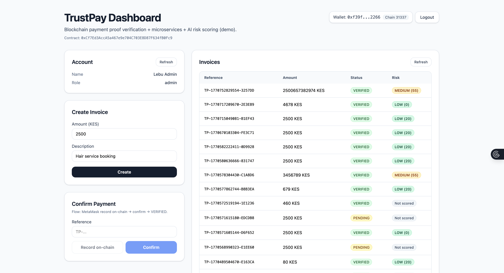

# TrustPay

## Blockchain Payment Verification & AI Risk Scoring Platform

TrustPay is a **microservices-based blockchain payment verification system** that allows businesses to create invoices, record payment proofs on-chain, verify transactions, and evaluate fraud risk using AI.

It demonstrates real-world fintech architecture combining:

- Blockchain verification
- Microservices architecture
- AI fraud detection
- Docker containerization
- MetaMask wallet integration

---

## 🚀 System Overview



TrustPay verifies payments using blockchain proof instead of manual confirmation.

### Payment Flow

1. Admin creates invoice  
2. MetaMask records payment proof on-chain  
3. Verify service validates the transaction  
4. AI risk service evaluates fraud risk  
5. Invoice marked **VERIFIED**

---

## 🧱 Architecture Overview

### Microservices

| Service | Port | Purpose |
|--------|------|--------|
| frontend | 5173 | React dashboard |
| auth-service | 4001 | Authentication & JWT |
| payment-service | 4002 | Invoice & payment logic |
| verify-service | 4003 | Blockchain verification |
| ai-risk-service | 4004 | Fraud risk scoring |
| hardhat | 8545 | Local blockchain |

---

## 🖥️ System Architecture Diagrams

### Use Case Diagram


### Component Diagram


### Sequence Flow


### Deployment Diagram


---

## 🛠️ Installation & Setup

### Requirements

- Node.js 18+
- Docker Desktop
- MetaMask Extension
- Git

---

### 1️⃣ Clone Repository

```bash
git clone https://github.com/yourusername/trustpay.git
cd trustpay